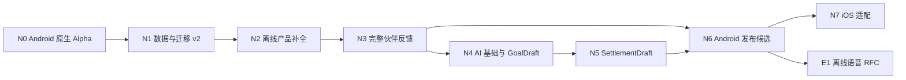

# Self Improvement Tracker：Post-MVP 开发路线图（方案 B）

状态：已整理，待按里程碑执行

基线：`998d494 feat: complete local-first basic MVP`

日期：2026-08-04

## 1. 路线结论

后续不重做基础 MVP。推荐按以下关键路径推进：



优先级判断：

1. **先关闭原生证据缺口。** 当前 Web、单元测试和 `cap sync` 已通过，但 APK 尚未构建、安装和真机验证；在此之前继续叠加功能会放大原生返工风险。
2. **再建立迁移与数据安全底座。** 当前 `schemaVersion` 固定为 1，后续 AppSettings、AI 历史和伙伴解锁都会修改持久数据，必须先证明升级失败可回滚。
3. **先完整离线体验和伙伴，再接 AI。** 伙伴是核心产品承诺；AI 只是用户主动调用的语义辅助，不能进入排序、奖励、存储和计时事实链。
4. **Android v1 达标后再做 iOS。** 领域与应用层始终保持平台无关，但不同时维护两个未稳定发布面。
5. **whisper.cpp 不进入 v1。** v1 只说明可使用系统输入法语音；独立离线语音在发布后先做 RFC。

## 2. 当前基线与缺口

### 已完成，禁止重复实现

- Goal 与首个 ActivityTemplate 的创建、编辑、暂停、归档和恢复；
- 离线确定性 Roll，最多返回 3 个候选；
- Flowtime、Countdown、暂停/恢复和绝对时间恢复；
- 手动结算、版本化 RewardLedger、撤销和 CompanionProjection 重建；
- 静态伙伴反馈、History、备注、导入、导出和全量清空；
- 浏览器 localStorage、Android SQLite、通知、文件分享等适配器；
- Vitest 14/14、Playwright 1/1、TypeScript、Vite build、`cap sync android`。

### 当前关键缺口

| 领域 | 现状 | 后续目标 |
|---|---|---|
| Android | 工程和 cap sync 已完成，APK 未验证 | 可构建、安装、离线运行并通过原生冒烟 |
| 数据 | schema v1，整包 load/replace | 可回滚迁移、版本化导入、失败不清库 |
| Goals | 一个表单同时编辑 Goal 与首个活动 | Goal 详情、多个活动模板、活动归档/恢复 |
| 反馈 | 列表文字摘要 | 各反馈模型的进度展示和最近活动 |
| 伙伴 | emoji + XP/等级投影 | 原创像素素材、3 阶段、4 状态、短动画与解锁 |
| AI | 尚未接入 | 可关闭的 GoalDraft、SettlementDraft 和安全适配层 |
| 设置 | 尚无持久 AppSettings | 通知、主题、动态、触觉、AI 与历史开关 |
| 发布 | 仅开发构建基线 | Android RC、第一性原理审查、对抗性审查 |

## 3. 全阶段共同门槛

每个里程碑必须满足以下 Definition of Done，任何一项失败都不进入下一阶段：

- 一个里程碑至少一个独立 Git commit；提交信息写明完成用例和验证结果；
- TypeScript、相关 Vitest、Playwright、Vite build 和 `cap sync` 全绿；
- 涉及 SQLite、通知、安全存储、文件或生命周期时，必须增加 Android 原生冒烟证据；
- 数据结构变更必须包含前向迁移、失败回滚、旧导出导入和新导出往返测试；
- 新依赖或素材先审计许可证，再更新 `THIRD_PARTY_NOTICES.md`；
- 新模块遵守模块头注释规范，复杂逻辑解释“为什么”；
- 不引入服务端、账户、同步、分析、广告、社交、事件总线、插件系统或通用工作流引擎；
- 确定输入输出的问题优先用脚本或纯函数解决，只有自然语言语义理解使用模型；
- 每阶段完成后执行 code-review、simplify，并把结论同步到 `progress.md`。

## 4. 里程碑总表

| 顺序 | 里程碑 | 优先级 | 主要交付物 | 建议原子提交包 |
|---:|---|---|---|---:|
| 1 | N0 Android 原生 Alpha | P0 | APK、安装与真机闭环证据、CI 基线 | 4–6 |
| 2 | N1 数据与迁移 v2 | P0 | MigrationRunner、AppSettings、回滚/恢复 | 4–6 |
| 3 | N2 离线产品补全 | P1 | Goal 详情、多活动模板、反馈视图、种子模式 | 5–7 |
| 4 | N3 完整伙伴反馈 | P1 | ActivityStateEngine、原创像素伙伴、解锁 | 4–6 |
| 5 | N4 AI 基础与 GoalDraft | P1 | ProviderAdapter、SecretStore、Goal 草稿 | 6–8 |
| 6 | N5 SettlementDraft | P1 | 自然语言结算草稿、可选 Roll 文案 | 4–6 |
| 7 | N6 Android 发布候选 | P0 | 可访问性、隐私、安全、对抗性审查、RC | 6–8 |
| 8 | N7 iOS 适配 | P2 | iOS 插件验证、TestFlight 候选 | 4–6 |
| 9 | E1 离线语音实验 RFC | Post-v1 | whisper.cpp 可行性结论，不直接实现 | 1–2 |

“提交包”表示可独立审查和回滚的变更单元，不是工期承诺。

## 5. N0：Android 原生 Alpha

### 目标

证明当前 MVP 不仅能在 Web 壳运行，也能在 Android 构建、安装、重启并保持完整离线闭环。

### 工作包

1. **固定可复现工具链**
   - 固定 Node `24.14.0`、npm `11.12.1`，避免继续以 Node 25 的边缘行为作为默认环境；
   - 本地构建记录 Oracle JDK `21.0.6+8`；CI 固定 Temurin `21.0.6+7.0.LTS`，两者都记录完整 `java -version`；
   - 固定 Android command-line tools `15859902`、SDK Platform 36、Build Tools `35.0.0` 和对应 platform-tools；
   - 恢复 Gradle `8.14.3-all`，校验 SHA-256 `ed1a8d686605fd7c23bdf62c7fc7add1c5b23b2bbc3721e661934ef4a4911d7c`；
   - 增加环境检查脚本，只检查确定性条件，不使用 AI。

2. **完成 Android 构建证据**
   - 运行 `assembleDebug`；
   - 安装到至少一个 API 级别匹配的模拟器或真机；
   - 验证冷启动、二次启动、强杀重启和离线启动；
   - 记录 APK 路径、版本、设备/API 级别和验证日志。

3. **原生插件冒烟**
   - SQLite：创建目标、完成一次闭环、强杀、重启、记录仍在；
   - Notifications：在 API 33+ 的允许态记录排程、后台/锁屏展示和 Session 结束后取消证据；拒绝态无崩溃且 Session 仍按持久事实恢复；
   - Doze/无精确闹钟权限时允许通知延迟，但不允许改变 Countdown 的绝对时间完成事实，延迟必须作为提醒降级明确记录；
   - Filesystem/Share：导出 JSON 能被系统分享，导入可恢复；
   - Countdown：后台、锁屏和重启后按绝对时间恢复；
   - 无网络：飞行模式下除 AI 外全部功能可用。

4. **证明无意外网络出口**
   - 检查 debug merged manifest，N0 必须不含 `android.permission.INTERNET`；
   - 为 WebView 增加 CSP，禁止远程脚本、字体、图片和默认连接；开发期只放行本机 Vite/HMR；
   - 静态扫描产品代码中的 `fetch`、XHR、WebSocket、远程 URL 和远程资源；
   - 在线运行 Web 壳时记录请求，除本机测试源外不得访问任何网络目标。

5. **建立 CI 基线**
   - 新增 `.github/workflows/ci.yml`；
   - 使用固定 runner、Node/npm、JDK、command-line tools、Platform 36、Build Tools 35.0.0 与 Gradle 校验；
   - 强制执行 `npm ci`、typecheck、Vitest、安装的 Playwright Chromium、Playwright、build、cap sync 和 `assembleDebug`；CI 不依赖预装 Edge；
   - 上传 Android 默认 debug key 生成的 debug-signed APK 与 SHA-256；未生成 APK 时 CI 必须失败；
   - CI 不接触真实 API key、签名文件或用户数据。

### 主要文件

- `package.json`、Node 版本文件、环境检查脚本；
- `android/gradle/wrapper/gradle-wrapper.properties`、`android/variables.gradle`；
- `.github/workflows/ci.yml`；
- Android instrumentation smoke test 与 `docs/testing/android-smoke.md`。

### 退出标准

- `assembleDebug` 成功，APK 可安装；
- CI 从干净检出独立完成 `assembleDebug`，上传 debug-signed APK 和校验值；
- 在真实 Android Runtime 上完成“创建 → Roll → Focus → 结算 → 撤销 → 重启 → 导出/导入”；
- 通知允许态可排程/展示/取消；拒绝、Doze 降级、离线和强杀不会造成静默数据丢失；
- merged manifest 无 INTERNET 权限，CSP、静态扫描和运行时请求记录共同证明 N0 无意外网络出口。

## 6. N1：数据、迁移与设置底座 v2

### 目标

让后续功能可以安全扩展持久结构，同时保留旧用户数据和恢复路径。

### 设计原则

- SQLite 仍是原生事实来源；React 状态只保存页面和未确认草稿；
- API key 永远不进入 SQLite、导出文件或日志；
- 暂不全面重写 Repository 层，先在现有 `DataStore` 边界增加迁移和事务能力；只有新用例确实需要时才拆细端口；
- 旧 `schemaVersion: 1` 快照必须可以升级，迁移失败不得自动清库。

### 工作包

1. **版本模型**
   - 区分 `PersistedSnapshotV1`、`CurrentAppSnapshot` 和导出 envelope；
   - 引入 `Migration` / `MigrationRunner`，每次迁移有 `from`、`to`、`up` 和校验；
   - SQLite `app_meta.schema_version` 不再每次初始化强制覆盖为 1。

2. **AppSettings**
   - 增加非秘密设置：主题、减少动态/无动画、触觉、通知、AI 功能开关、AI 历史开关；AI 历史默认关闭；
   - 默认值以纯函数产生，缺字段时安全补齐；
   - API endpoint/model 等普通 Provider 配置可后续放入设置，但 `apiKey` 只允许 SecretStore。

3. **事务与恢复**
   - 为 settlement/undo/import 建立显式原子事务契约或等价的单次原子 replace 证明；
   - 增加事务中途失败注入；
   - 增加迁移失败、磁盘不足/写入失败、损坏 JSON、重复导入的清晰错误路径；
   - 操作失败后内存快照与持久快照必须一致。

4. **导入导出 v2**
   - 旧 v1 导出仍可导入；
   - 新导出包含版本和非秘密 AppSettings；
   - 导入前验证、预览数据规模并二次确认；
   - 明确不包含 SecretStore 内容。

### 建议新增结构

```text
src/app/migrations/
src/modules/settings/
src/adapters/sqlite/migrations/
src/adapters/settings/
src/test/fixtures/exports/
```

### 测试

- v1 空库、典型库、边界库升级到 v2；
- 迁移步骤抛错后仍能读取旧库；
- 内存与 SQLite 共享契约；
- 结算、撤销、导入的失败注入与幂等；
- 导出内容秘密扫描。

### 退出标准

- 一个由 `998d494` 生成的真实 v1 数据库可无损升级；
- 迁移失败可恢复，不清空旧数据；
- AppSettings 跨重启保持；
- 导出/导入不包含 API key 或系统安全存储内容。

## 7. N2：离线产品能力补全

### 目标

把“一个目标加一个活动”的 MVP 管理界面升级为可长期使用的离线 Goal Catalog，同时保持快速 Roll。

### 工作包

1. **Goal 详情页**
   - 展示 Goal 描述、状态、反馈模型、最近活动和当前活动模板；
   - active/paused/archived 的动作与解释清楚；
   - 归档 Goal 不删除历史、Session 或 RewardLedger。

2. **多 ActivityTemplate 管理**
   - 独立的 create/update/archive/restore 用例；
   - 一个 Goal 可以有多个不同时间、精力和场景的活动；
   - 归档活动不参与新 Roll，但历史记录仍可解释；
   - 防止 active Goal 没有任何可执行活动时静默返回空结果。

3. **反馈模型展示**
   - progress：基线、当前值、目标值和进度条；
   - cumulative：累计分钟或次数；
   - experience：目标亲密度 XP；
   - 全部从 Session/RewardLedger 派生，不新增第二事实来源。

4. **最近活动与简洁 History**
   - Goal 详情只显示必要的最近记录；
   - 不加入周报、月报、趋势预测或精确能力评分；
   - 保留 History 作为全局原始记录入口。

5. **开发种子模式**
   - 一键生成日语学习、健身、摄影三个示例 Goal；
   - 只能在明确的开发/演示入口触发，不自动写入正式用户库；
   - 可完整清除并重复创建。

6. **快速操作验收**
   - 首次用户 5 分钟内建立第一个 Goal；
   - 已有数据用户 15 秒内完成一次 Roll；
   - 空候选时给出可操作原因，不引入 AI 猜测。

### 主要改动区域

- `src/modules/goals/`：活动模板用例和验证；
- `src/app/`：Goal/Activity 独立命令与 selectors；
- `src/ui/goals/`：Catalog、详情和活动编辑组件；
- `src/ui/history/`：Goal 上下文跳转；
- `src/test/fixtures/`：确定性种子数据。

### 退出标准

- 一个 Goal 能管理多个活动并正确参与 Roll；
- 三种反馈模型展示与撤销后的派生值一致；
- 所有能力断网可用；
- 没有新增统计、云同步或 AI 依赖。

## 8. N3：完整伙伴反馈与 ActivityStateEngine

### 目标

完成一个克制、正向、不制造负担的像素伙伴；伙伴反映活动与奖励，但不反向控制用户。

### 工作包

1. **ActivityStateEngine**
   - 以近期有效活动和时间衰减计算可解释的 `activityScore`；
   - 算法完全独立推导并版本化，不复制 GPL 项目的代码、常量或测试向量；
   - activityScore 可以作为确定性 Roll 的一个版本化本地因素，也可映射视觉状态；
   - 伙伴等级、心情或解锁不得反向改变 Roll。

2. **伙伴数据**
   - 保留 `RewardLedger` 为奖励事实来源；
   - 伙伴阶段、等级、状态和解锁都可由账本/活动事实重建；
   - 若 Reward rule 升级到 v2，旧 ruleVersion 1 条目仍可解释；
   - 撤销不会让历史最高进化阶段倒退，也不能制造重复 XP。

3. **视觉资产**
   - 一只原创伙伴，3 个进化阶段；
   - idle、working、celebrating、sleeping 四种非负面状态；
   - PNG/CSS 本地打包，保持 pixelated 渲染；
   - 原创素材使用 CC0 或 MIT，并登记归属与生成过程。

4. **交互反馈**
   - 结算庆祝最多 2 秒，不阻塞导航或下一步操作；
   - 减少动态/无动画模式显示等价的静态文字结果；
   - 少量房间物品/里程碑解锁，不加入金币、商店、战斗、生命值或连胜惩罚。

5. **公平性与滥用测试**
   - 固定种子模拟 30 天：每天学习、隔天健身、偶尔摄影、暂停项目；
   - 防止同一目标长期垄断、恢复期重复推荐和高奖励权重压制其他目标；
   - 测试一分钟任务、重复确认、撤销重结算、系统时间修改和请求重放。

### 退出标准

- 3 阶段 × 4 状态在 Android 与 Web 壳均可显示；
- 动画关闭后结果仍清楚；
- 伙伴不产生负面状态、惩罚、掉级压力或 Roll 偏置；
- 伙伴/解锁投影可从事实重建。

## 9. N4：AI 基础设施与 GoalDraft

### 目标

只为自然语言理解引入用户自带模型 API，先完成最小、安全、可关闭的 Goal 草稿能力。

### 开工前决策门槛

- 审计并选择一个 MIT 的 Capacitor Keychain/Keystore 插件，统一封装为 `SecretStore`；
- v1 推荐先支持 OpenAI-compatible Chat Completions，只有目标 Provider 确实需要时再在同一端口增加 Responses 协议；
- 生产版默认只允许 HTTPS endpoint；本地局域网明文 HTTP 必须另做显式安全决策，不能偷偷放开 `usesCleartextTraffic`；
- AI 默认关闭，每个 AI 用例有独立开关。

### 工作包

1. **类型命名清理**
   - 把当前表单输入 `GoalDraft`/`SettlementDraft` 与 AI Schema 输出区分开；
   - 推荐使用 `GoalInput`、`SettlementInput` 与 `AiGoalDraft`、`AiSettlementDraft`，避免把未验证模型输出当应用命令。

2. **ProviderAdapter**
   - 配置字段：`baseUrl`、`model`、可选 headers、`requestTimeout`；
   - `apiKey` 和任何认证类自定义 header 值仅通过 `SecretStore` 读取；普通设置至多保存非敏感 header 或秘密引用；
   - 支持 AbortSignal、超时、取消、响应大小限制、统一错误分类；
   - UI、领域和其他适配器禁止直接 `fetch` 模型地址。

3. **网络边界**
   - 只有到 N4 才为 Android 恢复 AI 所需 INTERNET 权限；
   - 静态检查产品代码中的网络调用，确保只存在 ProviderAdapter；
   - 禁止远程字体、图片、分析、更新检查或遥测；
   - 未配置/未主动触发 AI 时不得产生网络请求。

4. **SecretStore**
   - Android Keystore、未来 iOS Keychain；
   - Web 开发实现不得持久化真实 key，只允许当次会话临时值或测试占位；
   - 导出、清库、错误日志和 AI 历史都不读取/复制 key；
   - 设置页提供保存、替换、删除和连接测试。

5. **GoalDraft Schema**
   - 使用 Zod 校验：title、description、feedbackModel、importanceSuggestion、desiredCadenceDays、minimumRestHours、suggestedActivities、clarificationNeeded；
   - 活动建议包含时间范围、精力、场景、恢复和节奏字段；
   - 校验后进入可编辑草稿卡片；只有用户确认才调用现有 create/update 用例；
   - clarificationNeeded 为真时先询问用户，不补猜关键数据。

6. **AI 调用历史**
   - 默认关闭；开启后只记录请求类型、模型、Schema 版本、脱敏输入摘要、已验证输出、调用时间、耗时和结果；
   - 不记录请求头、API key 或原始敏感错误响应；
   - 提供清空入口和导出策略说明。

### 建议新增结构

```text
src/modules/ai/
  providerTypes.ts
  goalDraftSchema.ts
  aiInteractionLog.ts
src/adapters/ai/
  openAiCompatibleProvider.ts
src/adapters/secrets/
src/ui/settings/
src/ui/goals/AiGoalDraftPanel.tsx
```

### 测试

- 录制的 Provider contract fixtures，不依赖真实网络；
- 非法 JSON、缺字段、错误类型、越界、超长文本、超时、取消和 401/429/5xx；
- 恶意提示词和要求越权修改 Roll/奖励/数据库的文本；
- 草稿取消不写库，草稿编辑确认后才写库；
- key 不进入日志、SQLite、导出、截图测试或错误信息。

### 退出标准

- 用户可用自然语言生成并编辑 Goal/Activity 草稿；
- API 不可用时手动创建能力完全保留；
- 未确认模型输出无法写入正式数据；
- 除 ProviderAdapter 外没有产品网络出口。

## 10. N5：SettlementDraft 与可选 Roll 文案

### 目标

在保留现有手动结算的前提下，用 AI 把自然语言整理为可编辑结算草稿。

### 工作包

1. **自然语言入口**
   - Session 结束后提供文本输入；
   - 允许使用系统输入法自带语音，应用只接收普通文本；
   - 手动结构化表单始终可见或可一键切回。

2. **SettlementDraft Schema**
   - completionRatio、difficulty、effort、quantity、quantityUnit、summary、uncertainFields；
   - 无法确定的值必须为 `null`，不得猜测；
   - 数值边界由本地验证器再次校验；
   - 原始用户文本先保存在本地临时草稿，网络失败不丢失。

3. **确认流程**
   - AI 输出显示为可编辑预览；
   - 用户确认后才映射为 `SettlementInput` 并调用既有确定性 RewardEngine；
   - AI 不能计算 XP、修改 rewardWeight 或直接创建 RewardLedgerEntry。

4. **失败降级**
   - 超时、断网、key 失效、非法输出均回到手动结算；
   - 错误提示不暴露 key、headers 或完整 Provider 响应；
   - 同一个 Session 仍只能结算一次。

5. **可选 Roll 文案，非 v1 阻塞项**
   - 输入固定的本地候选 ID 和 reasonCode，只允许润色解释；
   - 输出必须保持候选集合、顺序和 ID 完全一致；
   - 增加、删除、重排或注入池外 ID 时整次丢弃，回退本地文案；
   - 若用户价值验证不足，直接延后，不影响 Android v1。

### 退出标准

- 自然语言结算可以生成、编辑、取消和确认；
- 非法输出不会污染 Session、RewardLedger 或 CompanionProjection；
- 模型停服时完整手动闭环仍成立；
- Roll 的选择和排序仍完全由本地确定性引擎决定。

## 11. N6：可访问性、隐私、安全与 Android 发布候选

### 目标

把功能完整版本收敛为可发布的 Android RC，并用第一性原理和对抗性测试证明产品边界。

### 工作包

1. **AppSettings 完整界面**
   - 跟随系统/浅色/深色；
   - 减少动态与完全无动画；
   - 触觉反馈开关；
   - 本地通知设置与权限说明；
   - AI 总开关、分功能开关、历史开关和系统输入法语音说明。

2. **可访问性**
   - 系统大字体下不裁切核心操作；
   - 屏幕阅读器标签、顺序和状态播报；
   - 不只用颜色或动画传递信息；
   - 触控目标、对比度、键盘和焦点可见性；
   - 奖励动画关闭后 XP 与结算结果仍明确。

3. **数据与生命周期压力测试**
   - 冷启动、低内存、进程死亡、设备重启；
   - 时区/系统时间变化、通知拒绝、Doze；
   - 数据库升级失败、磁盘不足、导入损坏文件；
   - 旧版本导出恢复到新版本。

4. **AI 对抗性测试**
   - 极长文本、提示注入、缺字段、错误类型、超长输出；
   - 候选池外任务、试图修改系统规则、恶意 URL/headers；
   - API 超时、取消、key 失效和 Provider 停服；
   - 所有失败有明确降级，无静默丢失。

5. **奖励与推荐审查**
   - 30 天公平性仿真；
   - 重复结算、撤销重放、一分钟任务、系统时间修改；
   - 无 NaN、负经验、重复奖励或恢复期违规推荐。

6. **隐私与供应链**
   - 扫描日志、导出、错误信息、SQLite 和构建产物中的秘密；
   - 枚举全部网络目标，确认无遥测、远程字体/图片和意外请求；
   - 生成依赖/素材许可证报告和 SBOM；
   - 复核 SQLCipher 相关加密出口申报；
   - 明确 Android 系统备份策略和数据删除行为。

7. **发布工程**
   - applicationId、版本号、图标、启动图、签名与构建变体；
   - release build、安装、升级和回滚路径；
   - 隐私说明、开源声明、第三方许可和用户数据说明；
   - RC 设备/API 级别矩阵与发布检查表。

8. **最终审查文档**
   - 第一性原理审查：空闲到行动的步骤、AI 必要性、离线价值、伙伴是否构成负担；
   - 对抗性审查：记录问题、复现、严重程度、修复提交和接受风险；
   - 生成 `ADVERSARIAL_REVIEW.md`；高严重度问题未关闭不得发布。

### Android v1 最终验收

- 首次用户 5 分钟内创建第一个目标；
- 用户 15 秒内完成一次 Roll；
- Roll 离线可用；
- 计时可从后台和强制关闭恢复；
- 结算可撤销且不能重复奖励；
- AI 非法输出不能污染数据库；
- 伙伴无惩罚、负面胁迫或掉级压力；
- 数据可完整导出和恢复，秘密不在导出中；
- 无必须运行的远程服务器或非用户主动网络请求；
- 全部测试、许可证、第一性原理审查和对抗性审查通过。

## 12. N7：iOS 适配

### 前置条件

Android v1 已通过 N6，领域/应用层不再有发布阻塞级结构变更。

### 工作包

- `cap add/sync ios` 与 Xcode 工程基线；
- SQLite 连接、迁移、事务和冷启动恢复；
- Keychain SecretStore；
- 本地通知权限、后台/重启恢复；
- Filesystem/Share 导入导出；
- 系统备份排除、隐私清单和网络安全配置；
- Voice input 说明、动态字体、VoiceOver、深色和减少动态；
- 签名、TestFlight 构建和 iOS 原生冒烟矩阵。

### 退出标准

- Android 与 iOS 共享同一领域/应用测试；
- iOS 不引入新的数据事实来源或平台分支业务规则；
- TestFlight 候选通过离线闭环、迁移、秘密和可访问性检查。

## 13. E1：发布后离线语音 RFC

此阶段只做可行性评估，不直接把 whisper.cpp 并入主应用：

- whisper.cpp 原生桥接与 Capacitor 生命周期；
- 模型权重许可证、下载/随包策略和完整性校验；
- 安装包体积、内存、耗电、低端设备性能和首帧延迟；
- 麦克风权限、录音临时文件、删除策略和隐私文案；
- Android/iOS 维护成本和失败降级；
- 与“继续使用系统输入法语音”相比是否有足够用户价值。

只有 RFC 证明价值高于体积、许可和维护成本后，才进入独立实验分支。

## 14. 建议的立即执行清单

下一次开发从 N0 开始，顺序如下：

1. 固定 Node LTS、JDK 21、Android SDK 36 和 Gradle 环境；
2. 在当前 `998d494` 基线执行 `assembleDebug`，不先改产品功能；
3. 安装 APK，完成 SQLite/通知/强杀/导入导出原生冒烟；
4. 建立 CI 与 Android smoke 记录；
5. N0 code-review + simplify + 独立提交；
6. 再为 N1 单独写数据迁移设计规格，审查通过后编码。

N0 未通过前，不启动 Goal 多活动、像素伙伴或 AI 接入。

## 15. 需要保留的决策门

以下决策无需阻塞 N0–N3，但必须在对应里程碑开工前确认：

| 决策 | 最晚确认点 | 推荐默认值 |
|---|---|---|
| 安全存储插件 | N4 前 | 审计后的 MIT Keychain/Keystore 插件，封装后使用 |
| Provider 协议 | N4 前 | 先 Chat Completions，按真实兼容需求再加 Responses |
| 明文局域网模型地址 | N4 前 | 生产版 HTTPS-only，明文访问不默认开放 |
| AI 历史导出 | N4 前 | 默认不导出；若开放则只含脱敏、已校验内容 |
| Roll 文案润色 | N5 后半 | 非 v1 阻塞，价值不足则延后 |
| 像素资产风格 | N3 前 | 一只原创伙伴、低刺激配色、CC0/MIT |
| Android 发布渠道/签名 | N6 前 | 先内部测试，再正式渠道 |

## 16. 明确不做

- 账户、云数据库、跨设备同步、排行榜、社交、广告、遥测；
- 待办清单、日历、习惯打卡、周/月统计和能力精确量化；
- 生命值、金币、装备、战斗、暴击、商店、连胜惩罚；
- AI 自动创建正式数据、计算奖励、改变 Roll 候选或排序；
- v1 内置 whisper.cpp；
- 为假想未来建立插件系统、事件总线、同步协议或通用工作流引擎。
